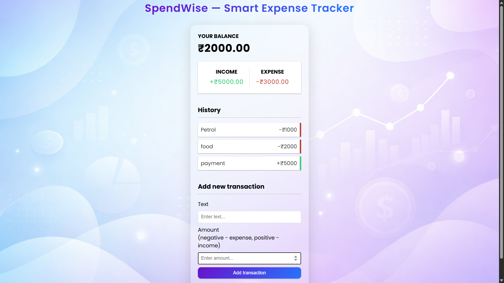

# 💸 SpendWise — Smart Expense Tracker

SpendWise is a modern and responsive expense tracking web application that helps users manage their income and expenses efficiently.

Built with **React.js**, this application focuses on clean UI, real-time balance updates, and persistent data storage for a seamless user experience.

---

## 🚀 Live Demo

👉 [https://spendwise-finance.netlify.app/](https://spendwise-finance.netlify.app/)

---

## ✨ Features

- ✅ Add income and expense transactions
- ✅ Delete transactions instantly
- ✅ Real-time balance calculation
- ✅ Persistent data using LocalStorage
- ✅ Clean and modern fintech UI
- ✅ Responsive design
- ✅ Component-based architecture

---

## 🛠️ Tech Stack

- **React.js** — Frontend library
- **Context API** — Global state management
- **JavaScript (ES6+)**
- **CSS3**
- **LocalStorage** — Data persistence

---

## 📸 Screenshots



---

## ⚡ Installation

### Clone the repository

```bash
git clone https://github.com/RishroJ/spendwise.git
```

### Navigate into the project

```bash
cd spendwise
```

### Install dependencies

```bash
npm install
```

### Start the development server

```bash
npm start
```

---

## 🎯 What I Learned

- Managing global state using Context API
- Building reusable React components
- Handling user input and form validation
- Persisting data with LocalStorage
- Designing production-style UI

---

## 📌 Future Improvements

- 📊 Expense analytics with charts
- 🌙 Dark mode
- 🔐 User authentication
- ☁️ Cloud database integration

---

## 👨‍💻 Author

**Jeyastinrishro J**

If you like this project, feel free to ⭐ the repo!
